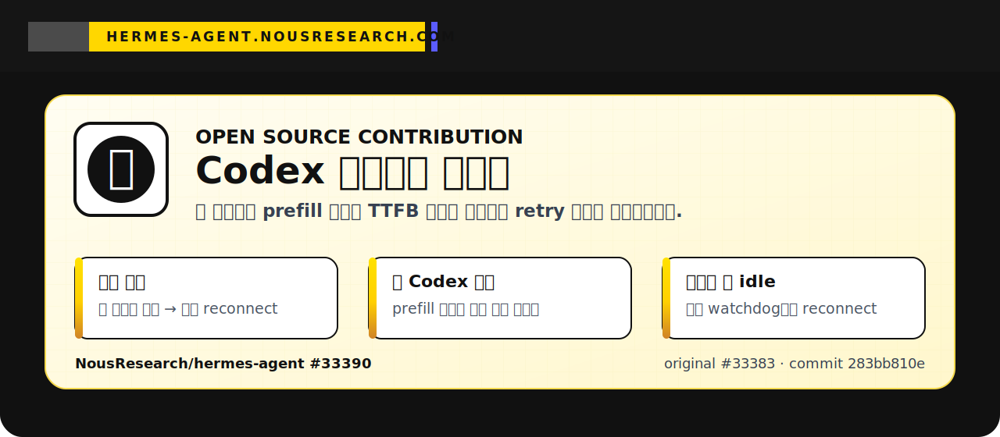

# Sanghyuk Seo

문제를 로그에서 끝까지 추적하고, 실제 사용자 경험을 망치는 병목을 재현 가능한 코드 수정으로 줄입니다.

  

  
  
  
  

## Open Source Highlight

  

  <a href="https://github.com/NousResearch/hermes-agent/pull/33390">
    <strong>원본 레포에서 병합된 PR 바로 보기 → NousResearch/hermes-agent#33390</strong>
  </a>

 

<table>
  <tr>
    <td width="16%" align="center">
      
    </td>
    <td width="44%">
      <h3>무엇을 고쳤나</h3>
      

        <strong>Hermes Agent</strong>의 <code>openai-codex</code> 스트리밍에서,
        긴 컨텍스트 요청이 backend prefill 때문에 늦어지는 상황을 장애로 오판하던 문제를 해결했습니다.
      

      

        기존에는 첫 SSE 이벤트가 늦으면 바로 <code>No first byte</code>로 보고 retry가 발생했습니다.
        기여한 패치에서는 요청 크기와 stream 상태를 나눠 <strong>3단계 watchdog 정책</strong>으로 안정화했습니다.
      

      

        <a href="https://github.com/NousResearch/hermes-agent/pull/33390">
          <strong>Upstream merged PR 보기</strong>
        </a>
      

    </td>
    <td width="40%">
      <h3>핵심 설계</h3>
      <ul>
        <li><strong>작은 요청 + 첫 이벤트 없음</strong>: 빠르게 reconnect</li>
        <li><strong>큰 Codex 요청 + 첫 이벤트 없음</strong>: backend prefill을 기다림</li>
        <li><strong>첫 이벤트 이후 idle</strong>: 별도 stream-idle watchdog으로 reconnect</li>
      </ul>
    </td>
  </tr>
</table>

<table>
  <tr>
    <td>
      
      

        <a href="https://github.com/NousResearch/hermes-agent/pull/33390"><strong>Upstream Merged PR #33390</strong></a>
        ·
        <a href="https://github.com/NousResearch/hermes-agent/pull/33383">Original PR #33383</a>
        ·
        <a href="https://github.com/NousResearch/hermes-agent/commit/283bb810e7211acc38171d3171bb6049ff6d4dba">Commit</a>
      

    </td>
  </tr>
</table>

## Focus

- AI agent runtime reliability
- Streaming UX and backend latency handling
- Provider integration and failure-mode analysis
- 로그 기반 원인 분석과 upstream 기여
